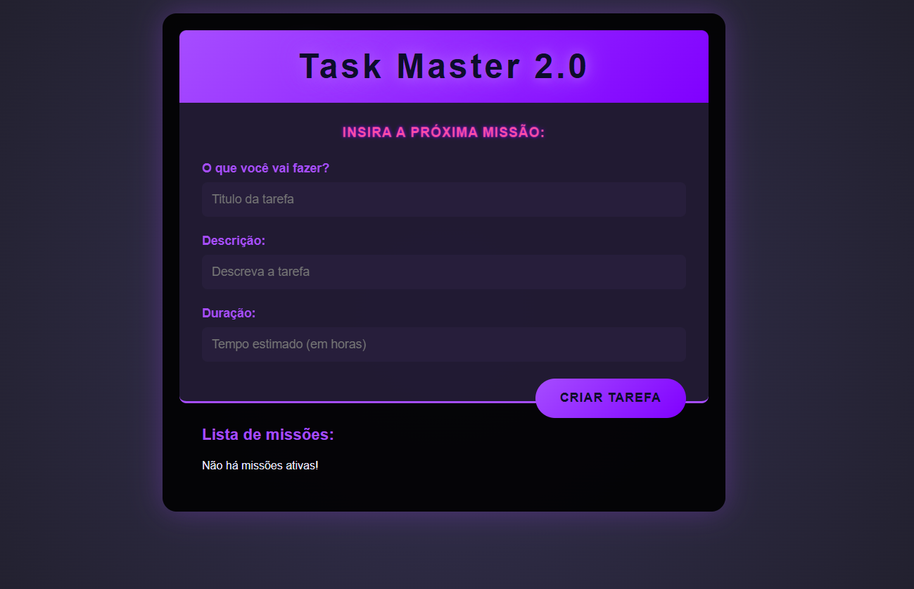

# 📋 Task Master - Gerenciador de Tarefas
<p align="center">
  
  
  
</p>

<div align="center">
  
</div>

## 🧾 Sobre o Projeto
O **Task Master** é uma aplicação de gerenciamento de tarefas desenvolvida com **React** para fins de aprendizado e demonstração de habilidades em desenvolvimento front-end.

A persistência dos dados é feita localmente através de um *mock server* com `json-server`, simulando uma API REST para testes durante o desenvolvimento.

## 🚀 Funcionalidades
* ✅ Adicionar, visualizar e remover tarefas
* ✍️ Marcar tarefas como concluídas
* 🌗 Alternar entre tema claro e escuro
* 🧠 Uso de *hooks* personalizados para lógica e tema
* 🔄 Persistência temporária com servidor *mock*

## 📁 Estrutura do Projeto
```
task-master/                            # Diretório raiz do projeto
├── data/                               # Pasta para dados simulados de backend
│   └── db.json                         # Arquivo que simula uma API REST via json-server
├── public/                             # Arquivos públicos acessíveis pelo navegador
│   ├── images/                         # Imagens como ícones ou logotipos usados pela UI
│   ├── favicon.ico                     # Ícone exibido na aba do navegador
│   ├── index.html                      # Arquivo HTML base da aplicação React
│   └── manifest.json                   # Manifesto para transformar o app em PWA
├── src/                                # Código-fonte da aplicação React
│   ├── assets/                         # Recursos estáticos (imagens, SVGs, etc.)
│   │   └── images/                     # Imagens específicas usadas pelos componentes
│   ├── components/                     # Componentes reutilizáveis de interface
│   │   ├── themeToggle.js              # Botão para alternância entre tema claro/escuro
│   │   ├── todoForm.js                 # Formulário para adicionar novas tarefas
│   │   ├── todoList.js                 # Componente que lista todas as tarefas
│   │   └── todoTasks.js                # Elemento que representa cada tarefa individual
│   ├── hooks/                          # Hooks personalizados do React
│   │   ├── useTheme.js                 # Hook para gerenciar o tema da aplicação
│   │   └── useTodo.js                  # Hook para lógica de tarefas (CRUD)
│   ├── styles/                         # Estilos CSS globais e modulares
│   │   └── App.css                     # Estilização principal da aplicação
│   ├── App.js                          # Componente principal que integra os demais
│   ├── App.test.js                     # Arquivo de testes automatizados do App
│   ├── index.js                        # Ponto de entrada do React DOM
│   ├── reportWebVitals.js              # Coleta métricas de performance do app
│   └── setupTests.js                   # Configuração para testes com Jest
├── .gitignore                          # Arquivos e pastas ignorados pelo Git
├── package-lock.json                   # Lockfile com versões exatas das dependências
├── package.json                        # Metadados do projeto e lista de dependências/scripts
└── README.md                           # Documentação do projeto (você está aqui!)

```

## 🕹️ Como Executar o Projeto
1. **Clone o repositório:**

   ```bash
   git clone https://github.com/devAndreotti/task-master.git
   cd task-master
   ```

2. **Instale as dependências:**

   ```bash
   npm install
   ```

3. **Inicie o servidor mock:**

   ```bash
   npm run server
   ```

4. **Inicie a aplicação React:**

   ```bash
   npm start
   ```

## 🛠 Tecnologias Utilizadas
* **React (Create React App)**
* **JavaScript (ES6+)**
* **CSS3**
* **json-server**
* **React Icons**

## 💪 Como Contribuir
1. Faça um **fork** do repositório.
2. Crie uma nova branch com sua funcionalidade:
   `git checkout -b feature/nova-feature`
3. Faça suas alterações e commit:
   `git commit -m 'Adiciona nova feature'`
4. Envie para o seu fork:
   `git push origin feature/nova-feature`
5. Abra um **Pull Request** 🚀

## 📝 Considerações Finais
Este projeto foi criado como exercício prático para aprofundar conhecimentos em **React**, gerenciamento de estado, componentização e integração com APIs simuladas. A interface foi pensada para ser limpa e intuitiva, mantendo foco na usabilidade.

<br>

---

<p align="center">
  Desenvolvido por <a href="https://github.com/seuUsuario">Ricardo Andreotti Gonçalves</a> 🧑‍💻
</p>

---
